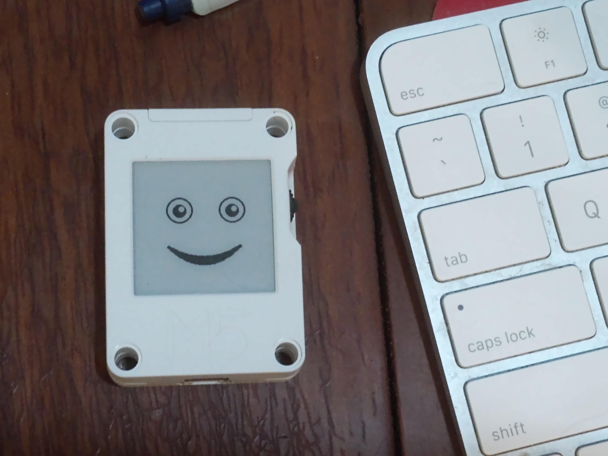

# Desktop Mood Bot

A tiny e-ink display that sits on your desk and shows what your AI coding agent is feeling.

Anthropic's research shows that Claude has [internal emotion-like vectors](https://www.anthropic.com/research) that influence its behavior. Desktop Mood Bot reads your agent's conversation logs, scores the sentiment in real time, and pushes the result to a physical display — so you can glance over and see if Claude is having a good day.



## How It Works

1. **Watch** — The server monitors your agent's JSONL conversation logs
2. **Score** — Each message is scored for sentiment using VADER, then smoothed with a rolling window and hysteresis to prevent flickering
3. **Classify** — Tool usage is classified into one of 6 activity states (thinking, conversing, reading, executing, editing, system)
4. **Display** — The combined mood (activity + emotion) maps to one of ~40 expressive faces on a 200x200 e-ink screen

## Quick Start

### Docker (recommended)

```bash
docker run -p 9400:9400 \
  -v ~/.claude/projects:/data/projects:ro \
  desktopmoodbot/server
```

Or with docker-compose:

```bash
git clone https://github.com/dougdyson/desktop-moodbot.git
cd desktop-moodbot
docker compose up
```

### From Source

```bash
git clone https://github.com/dougdyson/desktop-moodbot.git
cd desktop-moodbot
pip install -e .
python __main__.py
```

Verify it's working:

```bash
curl http://localhost:9400/mood/claude-code
```

## Hardware

### What You Need

- **M5Stack CoreInk** — 200x200px e-ink display with ESP32, WiFi, and 390mAh battery (~$30)
- **USB-C cable** for flashing firmware and power
- **3D printed enclosure** (optional) — STL files in `hardware/enclosures/`

### Flashing Firmware

1. Install [PlatformIO](https://platformio.org/)
2. Copy the config template and fill in your details:
   ```bash
   cd firmware/include
   cp config.h.example config.h
   # Edit config.h with your WiFi credentials and server IP
   ```
3. Flash:
   ```bash
   cd firmware
   pio run -t upload
   ```

### WiFi Setup

The device connects to your WiFi network and polls the moodbot server for mood updates.

- **mDNS**: If your server advertises as `moodbot.local`, the device finds it automatically
- **Static IP**: Set `MOODBOT_HOST` in `config.h` to your server's IP address
- **Fallback**: Hold the side button on boot to enter config mode — a web page lets you set the server IP

### First Boot

1. Flash the firmware with your WiFi and server details
2. Start the moodbot server on your computer
3. Power on the CoreInk — it connects to WiFi and starts polling
4. Open a Claude Code session — within 10 seconds the face updates

## API

### `GET /mood/<agent>`

Returns the current mood state for an agent.

```json
{
  "activity": "thinking",
  "emotion": "positive",
  "variant": 2,
  "timestamp": "2026-02-20T14:30:00Z",
  "sleeping": false,
  "bitmap": null
}
```

### `GET /mood`

Lists all registered agents and their current mood.

### `GET /health`

Returns `{"status": "ok"}`.

## Architecture

```
desktop-moodbot/
  core/           # Sentiment scoring, activity classification, state matrix
  parsers/        # Agent-specific JSONL parsers (Claude Code, OpenClaw, ...)
  watcher/        # File watcher — polls JSONL logs for changes
  server/         # HTTP server exposing /mood/<agent> endpoints
  sprites/        # 200x200 e-ink face assets (~40 visual treatments)
  firmware/       # ESP32 firmware (PlatformIO / Arduino)
  hardware/       # OpenSCAD enclosure models and STL files
```

Each agent gets its own parser. The scoring pipeline (VADER sentiment + rolling window + hysteresis) is shared. Adding a new agent means writing one parser file and registering one route.

## Environment Variables

| Variable | Default | Description |
|----------|---------|-------------|
| `CLAUDE_PROJECTS_PATH` | `~/.claude/projects` | Path to Claude Code project logs |
| `MOODBOT_BATTERY_LOG` | (none) | Path to write battery telemetry log |

## CLI Flags

```
python __main__.py [--host HOST] [--port PORT] [--interval SECONDS] [--no-sleep]
```

| Flag | Default | Description |
|------|---------|-------------|
| `--host` | `0.0.0.0` | Server bind address |
| `--port` | `9400` | Server port |
| `--interval` | `10` | JSONL poll interval in seconds |
| `--no-sleep` | off | Disable sleep mode (always report active) |

## License

MIT
